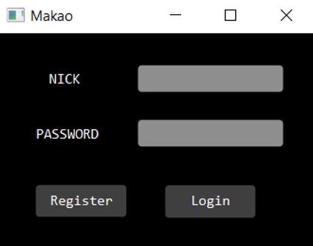
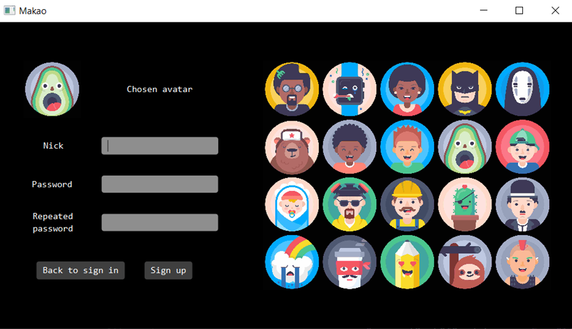
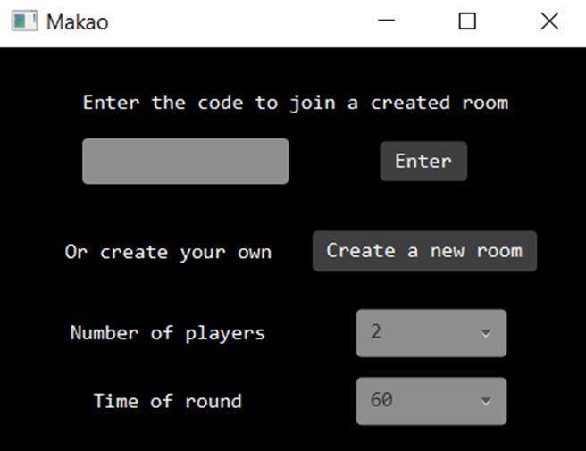
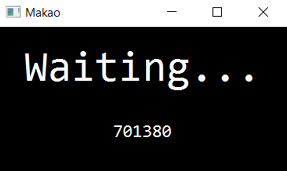
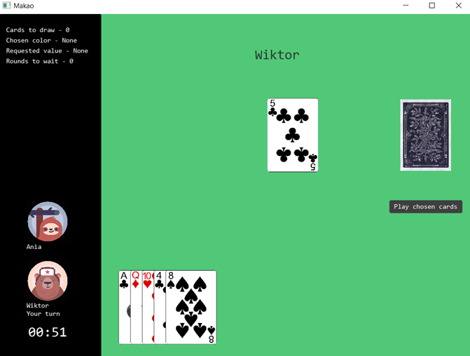
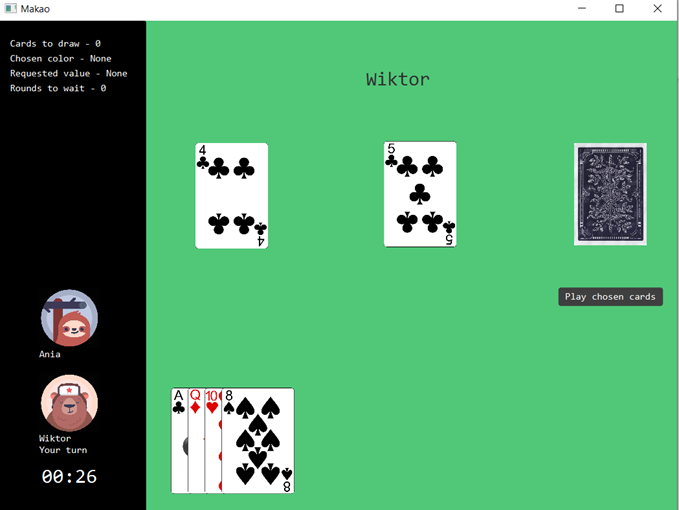
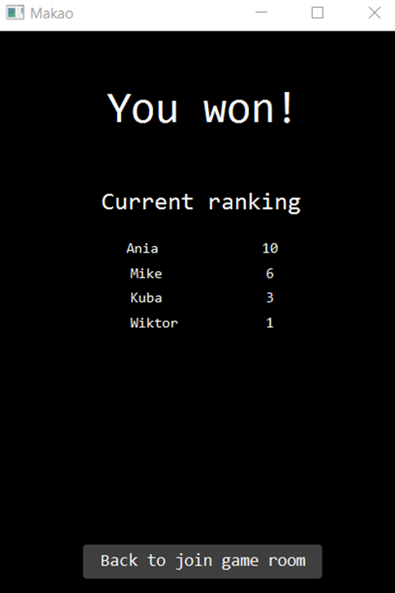
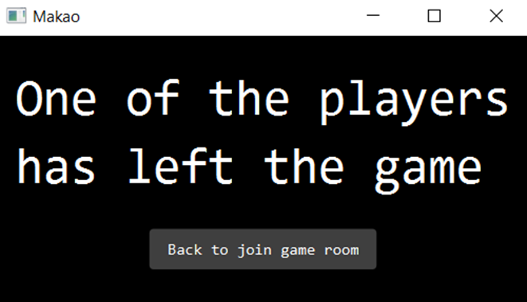

# Makao
An application that allows multiplayer game of Makao (a card game).

## Authors
Anna Szymańska, Dorota Wlazło

## Requirements:
- Java19
- JavaFX

## Functionality:
- conducting a game for a specified number of players,
- creating an account for a player,
- ranking players based on the number of wins.

## Usage

You need to run the main class Server once and the main class in the Main package (view) as many times as the number of clients you want to connect. The first window that appears is the login window. If we are not registered, we need to click the "Register" button, and if we are, we need to enter our login details and click "Login". 

 a)	After clicking "Register", the registration view will appear, where you need to enter your login details and select your avatar by clicking on a given icon. Registration will be completed after clicking "Sign up", and we will be automatically redirected to the login view. The same will happen after clicking "Back to sign in", but then the entered data will not be remembered. 

  b)	After clicking "Login", if our details are correct, we will be taken to a panel where we can create a game or join an existing one. 
 

If we want to create a new game, we need to select the number of players we want and the duration of each player's turn, and then click "Create a new room". We will then be taken to the waiting room view, where the number of our game will be displayed. If we want to join a game created by another player, we need to enter this number in the game selection panel and click "Enter". After clicking "Enter", we will also be taken to the waiting room.

If the appropriate number of players join the game with the number chosen by the creator, the players will be automatically transferred to the game view. The game is played according to the rules of Makao, which are described in more detail in this link:  
https://en.wikipedia.org/wiki/Macau_(card_game)  
The player can only play cards during their turn, and the turn time is counted down by a timer. During their turn, the player can select cards from their hand by clicking on them once, which will move them to the selected cards field (see Figure 6 for comparison). Clicking the "Play chosen cards" button will attempt to play the selected cards on the stack. If it is in accordance with the rules, the cards will be placed on the stack, otherwise they will return to the player's hand. The player can also draw a card during their turn by clicking on the card representing the deck. The player is informed about the current state of the game through a description in the upper left corner. If the timer runs out and the player has not made a move, a card will be automatically drawn for them and the turn will pass to the next player. If one of the players places all their cards on the stack, the players will be automatically transferred to the ranking view and the game result.

Clicking the "Back to join game room" button changes the view to the panel where you can create a new game or join an existing one (Figure 3).

If during the game one of the players leaves, the remaining players will be transferred to a panel with relevant information, where there is also a button "Back to join game room", which works the same way as in the ranking view. 

